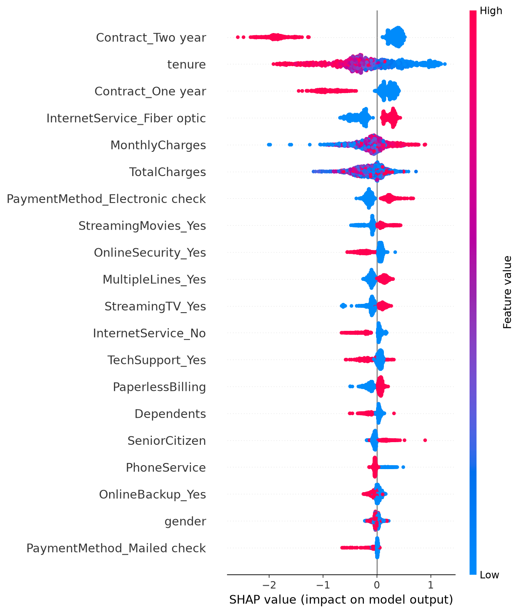
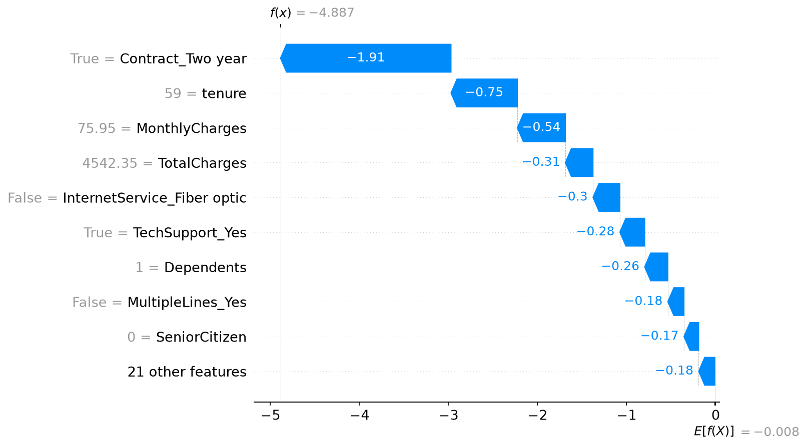

# Customer Churn Predictor

Predicting whether a telecom customer is going to churn (leave the company) based on their account details, services, and billing info. Built end to end — from raw data to a working app.

## Why this project

Churn prediction is one of those classic business problems where the cost of missing a churner is way higher than the cost of a false alarm. I wanted to build something that actually reflects that, instead of just chasing accuracy for the sake of it.

## Dataset

[Telco Customer Churn](https://www.kaggle.com/datasets/blastchar/telco-customer-churn) from Kaggle — 7043 customers, 21 features covering demographics, account info, and the services they're subscribed to. Target column is `Churn` (Yes/No).

## What I did

**Data cleaning**
- Found 11 missing values in `TotalCharges` (turned out to be customers with `tenure = 0`, i.e. brand new sign-ups) — dropped these rows since it was a negligible chunk of the data
- Dropped `customerID`, since it's just an identifier with zero predictive value

**EDA**
- Churn distribution is imbalanced — roughly 73% No, 27% Yes
- `tenure` has the strongest correlation with churn (-0.35) — customers who've stuck around longer are far less likely to leave
- Spotted multicollinearity between `tenure` and `TotalCharges` (0.83 correlation) — kept both in for now since tree-based models handle that fine, but noted it as a limitation
- Categorical breakdowns (Contract type, InternetService, PaymentMethod, etc.) showed clear churn patterns — month-to-month contracts and fiber optic users churn noticeably more

**Feature engineering**
- Mapped binary Yes/No and Male/Female columns to 1/0
- One-hot encoded the multi-category columns (Contract, InternetService, PaymentMethod, etc.)

**Modeling**
Tried three models, all evaluated with class imbalance handling (`class_weight='balanced'` / `scale_pos_weight`):

| Model | Precision (churn) | Recall (churn) | F1 (churn) |
|---|---|---|---|
| Logistic Regression | 0.55 | 0.64 | 0.59 |
| Random Forest | 0.55 | 0.64 | 0.59 |
| XGBoost (tuned) | 0.51 | 0.78 | 0.62 |

Went with **accuracy isn't the right metric here** — a model that just predicts "No churn" for everyone gets ~73% accuracy and is completely useless for the business. What actually matters is catching the customers who are about to leave, so I optimized for recall and f1 on the churn class instead.

XGBoost came out on top after hyperparameter tuning (`GridSearchCV`, 5-fold CV) — final params: `learning_rate=0.1, max_depth=5, n_estimators=100`. It catches 78% of actual churners, which is the number I care about most here.

**Explainability**
Used SHAP to understand what's actually driving the model's predictions, instead of treating it as a black box. This also makes the project a lot more useful for an actual business use case — you can tell *why* a customer is flagged as high risk, not just that they are.




## Tech stack

Python, pandas, scikit-learn, XGBoost, SHAP, Streamlit, joblib

## Running it locally

```bash
git clone https://github.com/soham-can/Customer-Churn-Predictor.git
cd Customer-Churn-Predictor
python -m venv .venv
.venv\Scripts\activate      # Windows
pip install -r requirements.txt
streamlit run app.py
```

## What I'd improve next

- Resolve the tenure/TotalCharges multicollinearity properly and check if it changes model performance
- Try SMOTE or other resampling techniques instead of just class weighting
- Deploy on HuggingFace Spaces for a live demo link
- Add more granular feature engineering (e.g. tenure buckets, charge-per-month ratios)
